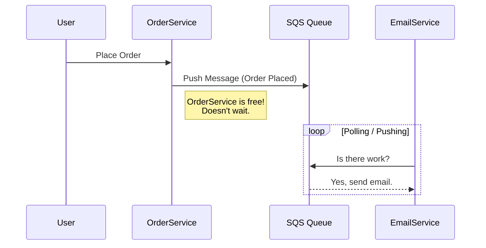
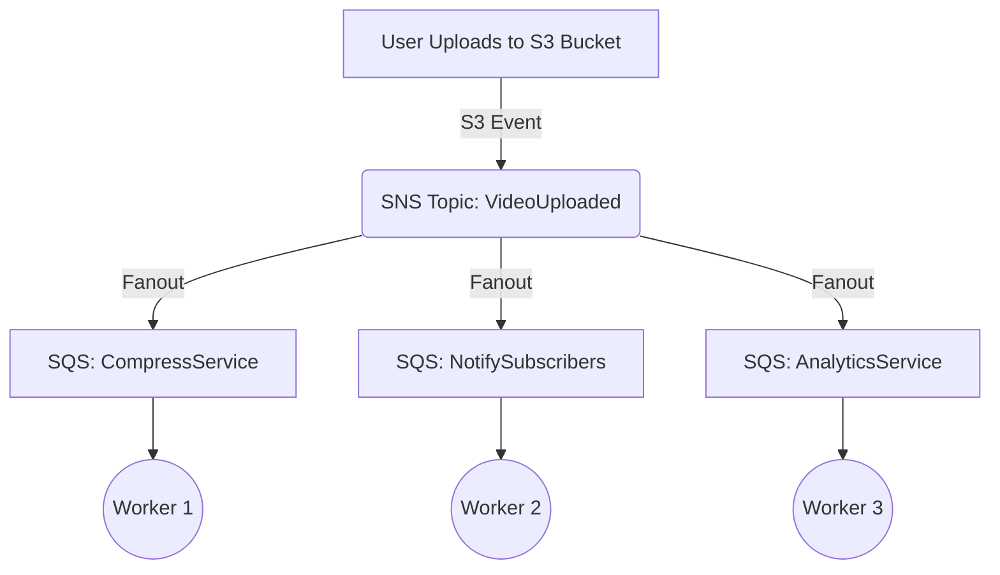
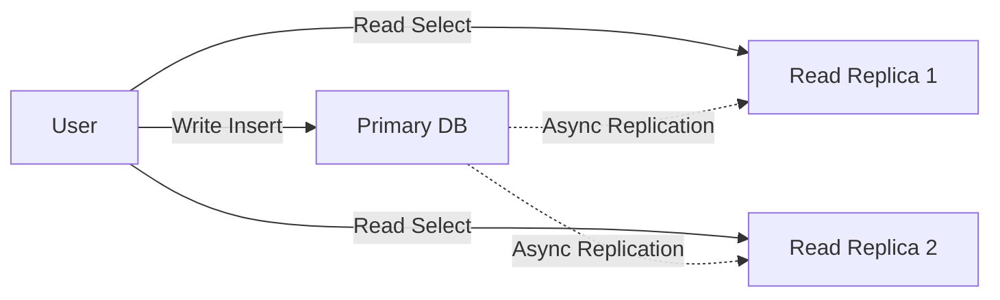
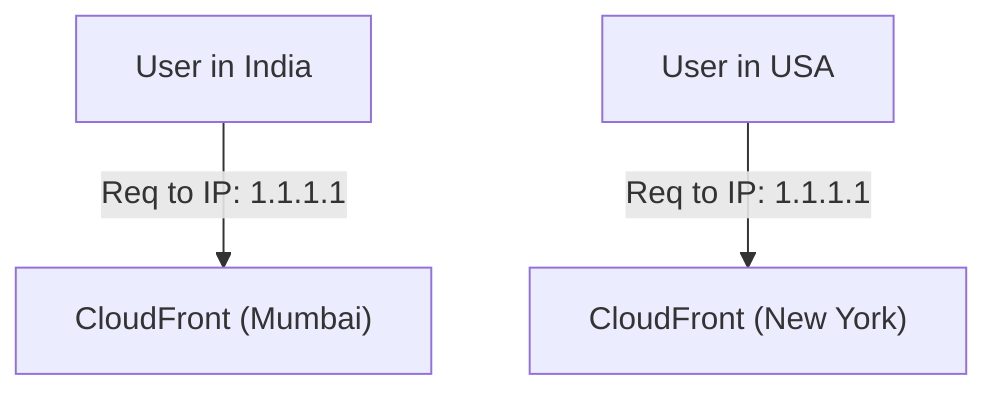
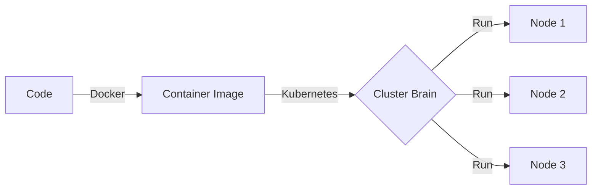
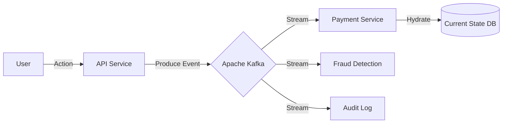
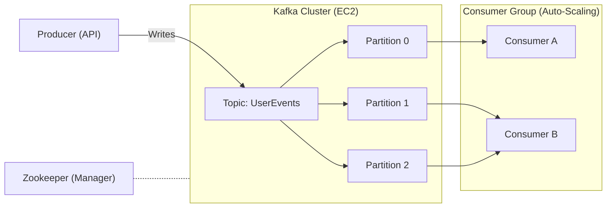
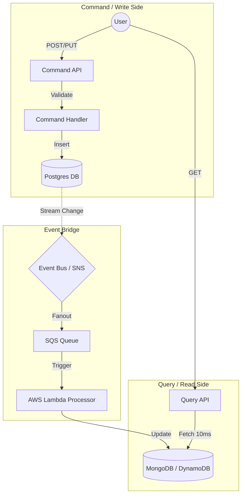

# System Design Learning Log

Documenting my journey learning Distributed Systems and High-Level Architecture.

## 2026-01-08 (Day 1)
**Playlist**: [System Design Series](https://www.youtube.com/playlist?list=PLinedj3B30sBlBWRox2V2tg9QJ2zr4M3o)

**Topics Covered**:
- **Scaling**: Learned the difference between Vertical (bigger hardware) and Horizontal (more machines) scaling. Horizontal is preferred for infinite scale.
- **Load Balancing**: Understood "Round Robin" algorithm to distribute traffic broadly.
- **API Gateway**: The "Front Door" pattern that routes requests to microservices.
- **Fan-out Architecture**: Using a pattern where one message is pushed to multiple queues for parallel processing.
- **Queues (SQS)**: Decoupling services so the sender doesn't wait for the receiver (Asynchronous processing).

---

## 2026-01-09 (Day 2)

**Focus**: Microservices Communication, Database Scaling, & Cloud Evolution.

### 1. 📨 Async Communication & Queues
**Problem**: How do Microservice A and Microservice B talk without crashing each other?
**Solution**: **Queues** (Decoupling).

**Push vs Poll**:
*   **Poll (Pull)**: "Are we there yet?" (Service B constantly asks Queue).
*   **Push (Webhook)**: "Ding Dong!" (Queue notifies Service B, like a doorbell ringing).

### 2. 📢 Pub/Sub & Fanout Pattern
**Concept**: One event happens (User Uploads Video), but arguably *many* things need to happen (Compress, Notify Friends, Analytics).
**Tool**: Combining **Pub/Sub** (AWS SNS) with **Queues** (AWS SQS).

### 3. 💾 Database Scaling: Master-Slave
**Rule**: Separation of Duties.
*   **Primary DB (Master)**: Handles **Writes** (INSERT, UPDATE). Source of Truth.
*   **Secondary DB (Read Replica)**: Handles **Reads** (SELECT). Used for analytical queries/reporting.

### 4. 🌍 Content Delivery Network (CDN) & Anycast
**Anycast**: Magic routing where multiple servers around the world share the **same IP address**. The user is routed to the *physically closest* one.

### 5. ⚡ Serverless (AWS Lambda)
**Concept**: "I just want to run this function. I don't want to manage a server."

*   **Pros**:
    *   💸 Pay per millisecond (Cheap for sporadic traffic).
    *   🚀 No Server Management.
*   **Cons**:
    *   🥶 **Cold Start**: First request takes time (spinning up the container).
    *   🔒 **Vendor Lock-in**: Hard to move code from AWS to Google later.

### 6. 🐳 Evolution of Compute
From "Works on my Machine" to "Works Everywhere".

**Timeline**:
1.  **Physical Servers**: Hard to maintain, waste of space.
2.  **Virtual Machines (VMs)**: Better, but OS overhead is heavy.
3.  **Containers (Docker)**: Lightweight, isolates just the app.
4.  **Container Orchestration (Kubernetes/K8s)**:
    *   *History*: Google had a secret system called **Borg** to manage billions of containers.
    *   *Release*: They open-sourced a version of it as **Kubernetes**.
    *   *Role*: It is the "Brain" that decides where containers run, restarts them if they crash, and scales them.

---

## 2026-01-10 (Day 3)

**Focus**: Advanced Data Architecture (Event Sourcing & Streaming).

### 1. 📜 Event Sourcing
**Concept**: Don't store the *State* (Current Balance), store the *Story* (every Transaction).

*   **TRADITIONAL (State-Oriented)**:
    *   DB Record: `{ "user": "vedant", "balance": 100 }`
    *   *Problem*: You lose history. How did we get to 100?

*   **EVENT SOURCING**:
    *   Event 1: `AccountCreated`
    *   Event 2: `Deposited 50`
    *   Event 3: `Withdrew 10`
    *   Event 4: `Deposited 60`
    *   *State Calculation (Hydration)*: `0 + 50 - 10 + 60 = 100`.

**Hydration**:
The process of creating the "Current State" by replaying the entire history of events from the beginning.

### 2. 🌊 Event Streaming
**Concept**: "Event Sourcing is the Database. Event Streaming is the Pipe."

*   **The Processor Sync Problem**: If you have concurrent streams, how do ensure `Deposited 50` happens *before* `Withdrew 10`?
*   **Solution (Kafka)**:
    *   **Partitions**: You guarantee that ALL events for "User 123" go to **Partition #1**.
    *   **Consumer Group**: The processor reads Partition #1 in strict order (FIFO). This solves the synchronization issue.

**Architecture**:

---

## 2026-01-11 (Day 4)

**Focus**: Event Streaming at Scale (Apache Kafka).

### 1. 🚀 Why Kafka? (High Throughput)
*   **The Problem**: HTTP/REST is 1-to-1 and slow. Standard Queues (SQS) can get overwhelmed.
*   **The Solution**: Kafka acts as a "Commit Log". It writes to disk sequentially (fast) and allows **Millions of events/sec**.
*   **Hybrid Model**: It is both a **Queue** (P2P) and **Pub/Sub** (Broadcast).

### 2. 🏗️ Kafka Architecture
The system is built of 3 main parts (managed by **Zookeeper**):

1.  **Broker**: The Kafka Server (EC2 Instance) that holds data.
2.  **Topic**: The Category name (e.g., `OrderCreated`, `UserClicked`).
3.  **Partition**: The "Scaling Unit". A Topic is sliced into Partitions to spread load.
    *   *Analogy*: Topic = Highway. Partition = Lane.

**Zookeeper**: The "Manager". It tracks which Broker is alive and who is the Leader of a partition.

### 3. 👥 Consumer Groups & Auto-balancing
**Concept**: How to process a massive topic in parallel?
*   **Consumer Group**: A team of workers (Microservices).
*   **Rule**: One Partition can be read by ONLY ONE Consumer in a group.
*   **Auto-balancing**: If a Consumer crashes, Kafka/Zookeeper automatically re-assigns its partitions to the surviving consumers.

**Architecture Flow**:

---

## 2026-01-12 (Day 5)

**Focus**: CQRS (Command Query Responsibility Segregation) & Advanced Event Sourcing.

### 1. ⚔️ CQRS: Breaking the Monolith

**Concept**: In a traditional DB, the same "Table" is used for Reading and Writing. This causes bottlenecks (Locks).
**Solution**: **Segregate** (Separate) the **Command** (Write) responsibilities from the **Query** (Read) responsibilities.

*   **Left Side (Write Model)**:
    *   **Goal**: Integrity & Speed of Ingestion.
    *   **Operations**: `POST`, `PUT`, `DELETE` (Create/Update).
    *   **Database**: **PostgreSQL** (Normalized, Relational).
    *   **Logic**: "Command Handler" validates the rules.
*   **Right Side (Read Model)**:
    *   **Goal**: Fast Retrieval (No complex Joins).
    *   **Operations**: `GET` (Read).
    *   **Database**: **MongoDB / DynamoDB** (Denormalized, JSON).
    *   **Logic**: "Query Handler" just fetches the data.

### 2. 🔄 The Sync Flow (Event Sourcing Integration)
How do we get data from the *Write DB* (Postgres) to the *Read DB* (Mongo)? **Event Streaming!**

**The AWS Flow Explained**:
1.  **User** sends a Command (`Buy Item`).
2.  **Command API** writes to **Postgres** (Write DB).
3.  **Postgres** (or the Service) publishes an event: `ItemPurchased`.
4.  **Event Bus (SNS/Kafka)** receives it.
5.  **Fan-out**: The event goes to a **SQS Queue**.
6.  **Lambda Trigger**: The SQS Queue triggers a **Lambda Function**.
7.  **Lambda** updates the **Read DB** (Mongo/Dynamo).

**Visualizing the Architecture**:

### 3. pro-tips from Today
**A. ⏳ Eventual Consistency**:
You figured it out! The "Famous" Eventual Consistency is literally just **The Time spent in the SQS Queue**.
*   User clicks "Buy".
*   Postgres says "Saved".
*   *... 200ms delay in Queue ...*
*   Mongo says "Updated".
*   **The "Eventual" part is that 200ms lag.**

**B. 💾 Postgres (Logs) vs Mongo (State)**:
*   **Postgres (Write Side)**: Stores the **Log** ("User bought item A", "User bought item B"). It has *everything* (History).
*   **Mongo (Read Side)**: Stores the **Result** ("User owns 2 items"). It is just a specific *View* of the data optimized for speed.

**C. 🌍 fast CDN Updates (Cache Invalidation)**:
*   **Problem**: You updated the Price in the DB, but the CDN (CloudFront) still shows the old price.
*   **Flow**:
    `SNS (PriceChanged) -> Lambda -> CloudFront (Invalidate Cache)`
*   This triggers the CDN to delete the old file and fetch the new price immediately.

### 4. 🧠 Cache vs Database Decision
**"Why not put the whole Mongo DB into Cache?"**

1.  **Cost**: Cache (RAM) is expensive. Disk (Mongo) is cheap.
2.  **Size**: Netflix has Petabytes of videos. You can't fit that in RAM.
3.  **Data Type Rule**:
    *   **CDN (CloudFront)**: Use for **Static Files** (Profile Pics, Videos, CSS). Things that don't change often.
    *   **Cache (Redis)**: Use for **Session Data** or **Hot Data** (Top 10 Leaderboard, Shopping Cart). Things accessed 1000x/sec.
    *   **NoSQL (Mongo)**: Use for **Structured Data** (User Profiles, Orders, Comments). The "Permanent Record".
