# System Design Learning Log

Documenting my journey learning Distributed Systems and High-Level Architecture.

## 2026-01-08 (Day 1)
**Playlist**: [System Design Series](https://www.youtube.com/playlist?list=PLinedj3B30sBlBWRox2V2tg9QJ2zr4M3o)

**Topics Covered**:
- **Scaling**: Learned the difference between Vertical (bigger hardware) and Horizontal (more machines) scaling. Horizontal is preferred for infinite scale.
- **Load Balancing**: Understood "Round Robin" algorithm to distribute traffic broadly.
- **API Gateway**: The "Front Door" pattern that routes requests to microservices.
- **Fan-out Architecture**: Using a pattern where one message is pushed to multiple queues for parallel processing.
- **Queues (SQS)**: Decoupling services so the sender doesn't wait for the receiver (Asynchronous processing).

---

## 2026-01-09 (Day 2)

**Focus**: Microservices Communication, Database Scaling, & Cloud Evolution.

### 1. 📨 Async Communication & Queues
**Problem**: How do Microservice A and Microservice B talk without crashing each other?
**Solution**: **Queues** (Decoupling).

**Push vs Poll**:
*   **Poll (Pull)**: "Are we there yet?" (Service B constantly asks Queue).
*   **Push (Webhook)**: "Ding Dong!" (Queue notifies Service B, like a doorbell ringing).

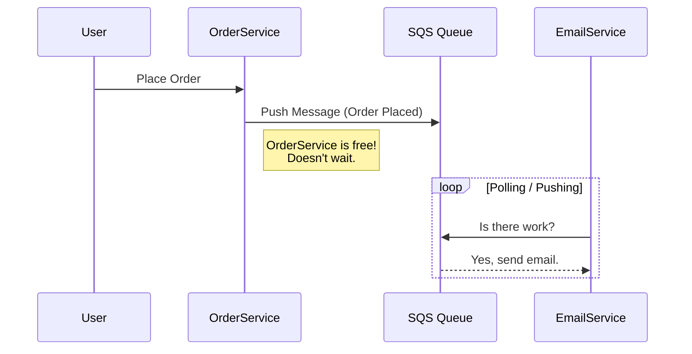
```mermaid
sequenceDiagram
    participant User
    participant OrderService
    participant Queue as SQS Queue
    participant EmailService

    User->>OrderService: Place Order
    OrderService->>Queue: Push Message (Order Placed)
    Note right of OrderService: OrderService is free! <br/> Doesn't wait.
    
    loop Polling / Pushing
        EmailService->>Queue: Is there work?
        Queue-->>EmailService: Yes, send email.
    end
```

### 2. 📢 Pub/Sub & Fanout Pattern
**Concept**: One event happens (User Uploads Video), but arguably *many* things need to happen (Compress, Notify Friends, Analytics).
**Tool**: Combining **Pub/Sub** (AWS SNS) with **Queues** (AWS SQS).

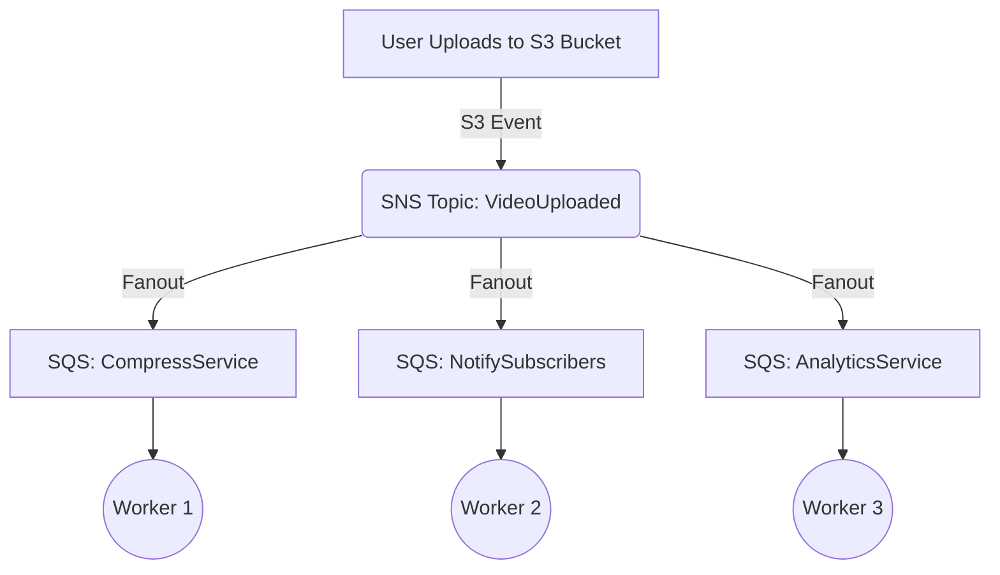
```mermaid
graph TD
    A["User Uploads to S3 Bucket"] -->|S3 Event| B("SNS Topic: VideoUploaded")
    
    B -->|Fanout| C["SQS: CompressService"]
    B -->|Fanout| D["SQS: NotifySubscribers"]
    B -->|Fanout| E["SQS: AnalyticsService"]
    
    C --> F(("Worker 1"))
    D --> G(("Worker 2"))
    E --> H(("Worker 3"))
```

### 3. 💾 Database Scaling: Master-Slave
**Rule**: Separation of Duties.
*   **Primary DB (Master)**: Handles **Writes** (INSERT, UPDATE). Source of Truth.
*   **Secondary DB (Read Replica)**: Handles **Reads** (SELECT). Used for analytical queries/reporting.

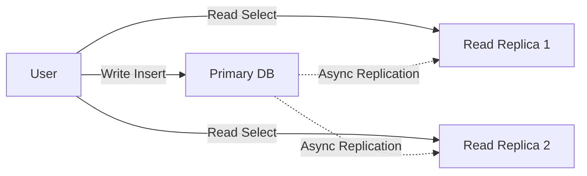
```mermaid
graph LR
    User -->|Write Insert| Master["Primary DB"]
    User -->|Read Select| Slave1["Read Replica 1"]
    User -->|Read Select| Slave2["Read Replica 2"]
    
    Master -.->|Async Replication| Slave1
    Master -.->|Async Replication| Slave2
```

### 4. 🌍 Content Delivery Network (CDN) & Anycast
**Anycast**: Magic routing where multiple servers around the world share the **same IP address**. The user is routed to the *physically closest* one.

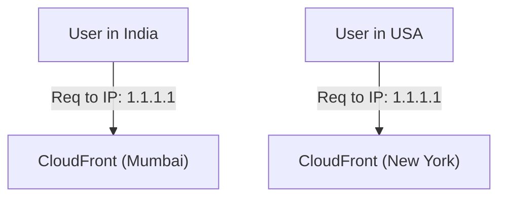
```mermaid
graph TD
    User["User in India"] -->|Req to IP: 1.1.1.1| EdgeIN["CloudFront (Mumbai)"]
    User2["User in USA"] -->|Req to IP: 1.1.1.1| EdgeUS["CloudFront (New York)"]
```

### 5. ⚡ Serverless (AWS Lambda)
**Concept**: "I just want to run this function. I don't want to manage a server."

*   **Pros**:
    *   💸 Pay per millisecond (Cheap for sporadic traffic).
    *   🚀 No Server Management.
*   **Cons**:
    *   🥶 **Cold Start**: First request takes time (spinning up the container).
    *   🔒 **Vendor Lock-in**: Hard to move code from AWS to Google later.

### 6. 🐳 Evolution of Compute
From "Works on my Machine" to "Works Everywhere".

**Timeline**:
1.  **Physical Servers**: Hard to maintain, waste of space.
2.  **Virtual Machines (VMs)**: Better, but OS overhead is heavy.
3.  **Containers (Docker)**: Lightweight, isolates just the app.
4.  **Container Orchestration (Kubernetes/K8s)**:
    *   *History*: Google had a secret system called **Borg** to manage billions of containers.
    *   *Release*: They open-sourced a version of it as **Kubernetes**.
    *   *Role*: It is the "Brain" that decides where containers run, restarts them if they crash, and scales them.

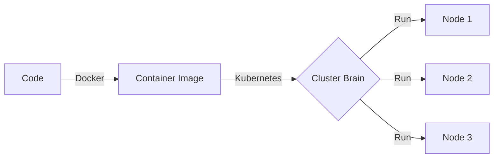
```mermaid
graph LR
    A["Code"] -->|Docker| B["Container Image"]
    B -->|Kubernetes| C{"Cluster Brain"}
    C -->|Run| D["Node 1"]
    C -->|Run| E["Node 2"]
    C -->|Run| F["Node 3"]
```

---

## 2026-01-10 (Day 3)

**Focus**: Advanced Data Architecture (Event Sourcing & Streaming).

### 1. 📜 Event Sourcing
**Concept**: Don't store the *State* (Current Balance), store the *Story* (every Transaction).

*   **TRADITIONAL (State-Oriented)**:
    *   DB Record: `{ "user": "vedant", "balance": 100 }`
    *   *Problem*: You lose history. How did we get to 100?

*   **EVENT SOURCING**:
    *   Event 1: `AccountCreated`
    *   Event 2: `Deposited 50`
    *   Event 3: `Withdrew 10`
    *   Event 4: `Deposited 60`
    *   *State Calculation (Hydration)*: `0 + 50 - 10 + 60 = 100`.

**Hydration**:
The process of creating the "Current State" by replaying the entire history of events from the beginning.

### 2. 🌊 Event Streaming
**Concept**: "Event Sourcing is the Database. Event Streaming is the Pipe."

*   **The Processor Sync Problem**: If you have concurrent streams, how do ensure `Deposited 50` happens *before* `Withdrew 10`?
*   **Solution (Kafka)**:
    *   **Partitions**: You guarantee that ALL events for "User 123" go to **Partition #1**.
    *   **Consumer Group**: The processor reads Partition #1 in strict order (FIFO). This solves the synchronization issue.

**Architecture**:
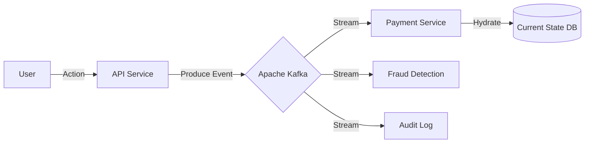
```mermaid
graph LR
    User -->|Action| API[API Service]
    API -->|Produce Event| Kafka{Apache Kafka}
    
    Kafka -->|Stream| Consumer1[Payment Service]
    Kafka -->|Stream| Consumer2[Fraud Detection]
    Kafka -->|Stream| Consumer3[Audit Log]
    
    Consumer1 -->|Hydrate| DB[(Current State DB)]
```

---

## 2026-01-11 (Day 4)

**Focus**: Event Streaming at Scale (Apache Kafka).

### 1. 🚀 Why Kafka? (High Throughput)
*   **The Problem**: HTTP/REST is 1-to-1 and slow. Standard Queues (SQS) can get overwhelmed.
*   **The Solution**: Kafka acts as a "Commit Log". It writes to disk sequentially (fast) and allows **Millions of events/sec**.
*   **Hybrid Model**: It is both a **Queue** (P2P) and **Pub/Sub** (Broadcast).

### 2. 🏗️ Kafka Architecture
The system is built of 3 main parts (managed by **Zookeeper**):

1.  **Broker**: The Kafka Server (EC2 Instance) that holds data.
2.  **Topic**: The Category name (e.g., `OrderCreated`, `UserClicked`).
3.  **Partition**: The "Scaling Unit". A Topic is sliced into Partitions to spread load.
    *   *Analogy*: Topic = Highway. Partition = Lane.

**Zookeeper**: The "Manager". It tracks which Broker is alive and who is the Leader of a partition.

### 3. 👥 Consumer Groups & Auto-balancing
**Concept**: How to process a massive topic in parallel?
*   **Consumer Group**: A team of workers (Microservices).
*   **Rule**: One Partition can be read by ONLY ONE Consumer in a group.
*   **Auto-balancing**: If a Consumer crashes, Kafka/Zookeeper automatically re-assigns its partitions to the surviving consumers.

**Architecture Flow**:
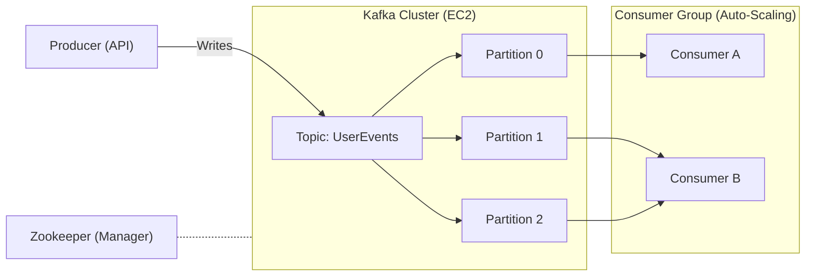
```mermaid
graph LR
    prod["Producer (API)"] -->|Writes| Topic["Topic: UserEvents"]
    
    subgraph KafkaCluster ["Kafka Cluster (EC2)"]
        direction TB
        Topic --> P1["Partition 0"]
        Topic --> P2["Partition 1"]
        Topic --> P3["Partition 2"]
    end

    subgraph ConsumerGroup ["Consumer Group (Auto-Scaling)"]
        P1 --> C1["Consumer A"]
        P2 --> C2["Consumer B"]
        P3 --> C2
    end
    
    ZK["Zookeeper (Manager)"] -.- KafkaCluster
```

---

## 2026-01-12 (Day 5)

**Focus**: CQRS (Command Query Responsibility Segregation) & Advanced Event Sourcing.

### 1. ⚔️ CQRS: Breaking the Monolith
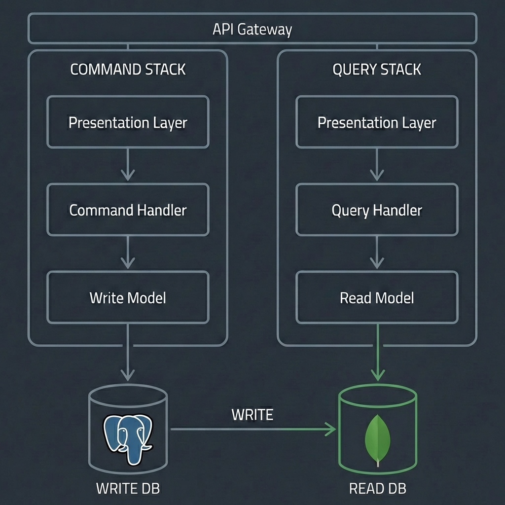

**Concept**: In a traditional DB, the same "Table" is used for Reading and Writing. This causes bottlenecks (Locks).
**Solution**: **Segregate** (Separate) the **Command** (Write) responsibilities from the **Query** (Read) responsibilities.

*   **Left Side (Write Model)**:
    *   **Goal**: Integrity & Speed of Ingestion.
    *   **Operations**: `POST`, `PUT`, `DELETE` (Create/Update).
    *   **Database**: **PostgreSQL** (Normalized, Relational).
    *   **Logic**: "Command Handler" validates the rules.
*   **Right Side (Read Model)**:
    *   **Goal**: Fast Retrieval (No complex Joins).
    *   **Operations**: `GET` (Read).
    *   **Database**: **MongoDB / DynamoDB** (Denormalized, JSON).
    *   **Logic**: "Query Handler" just fetches the data.

### 2. 🔄 The Sync Flow (Event Sourcing Integration)
How do we get data from the *Write DB* (Postgres) to the *Read DB* (Mongo)? **Event Streaming!**

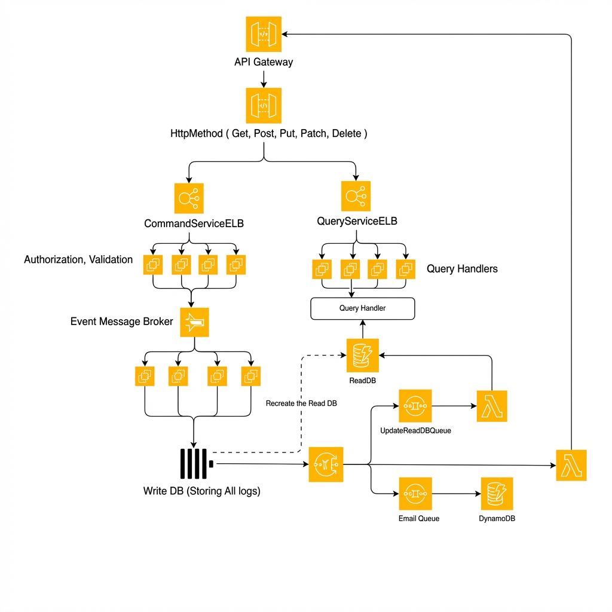

**The AWS Flow Explained**:
1.  **User** sends a Command (`Buy Item`).
2.  **Command API** writes to **Postgres** (Write DB).
3.  **Postgres** (or the Service) publishes an event: `ItemPurchased`.
4.  **Event Bus (SNS/Kafka)** receives it.
5.  **Fan-out**: The event goes to a **SQS Queue**.
6.  **Lambda Trigger**: The SQS Queue triggers a **Lambda Function**.
7.  **Lambda** updates the **Read DB** (Mongo/Dynamo).

**Visualizing the Architecture**:
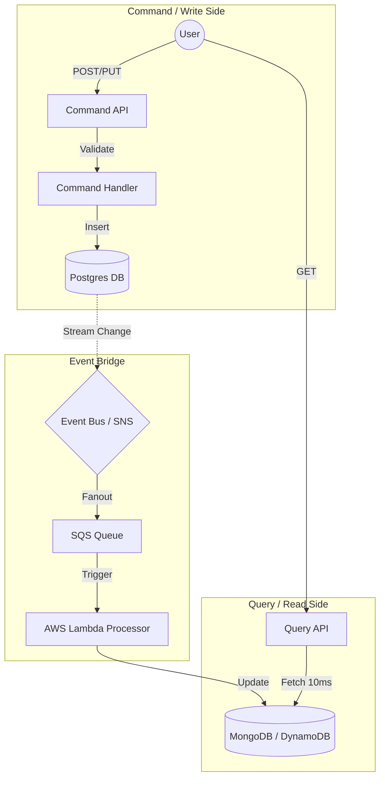
```mermaid
graph TD
    User((User))
    
    subgraph WriteSide [Command / Write Side]
        User -->|POST/PUT| CMD_API[Command API]
        CMD_API -->|Validate| Handler[Command Handler]
        Handler -->|Insert| WriteDB[(Postgres DB)]
    end
    
    subgraph Sync [Event Bridge]
        WriteDB -.->|Stream Change| EventBus{Event Bus / SNS}
        EventBus -->|Fanout| Queue[SQS Queue]
        Queue -->|Trigger| Lambda[AWS Lambda Processor]
    end
    
    subgraph ReadSide [Query / Read Side]
        Lambda -->|Update| ReadDB[(MongoDB / DynamoDB)]
        User -->|GET| QueryAPI[Query API]
        QueryAPI -->|Fetch 10ms| ReadDB
    end
```

### 3. pro-tips from Today
**A. ⏳ Eventual Consistency**:
You figured it out! The "Famous" Eventual Consistency is literally just **The Time spent in the SQS Queue**.
*   User clicks "Buy".
*   Postgres says "Saved".
*   *... 200ms delay in Queue ...*
*   Mongo says "Updated".
*   **The "Eventual" part is that 200ms lag.**

**B. 💾 Postgres (Logs) vs Mongo (State)**:
*   **Postgres (Write Side)**: Stores the **Log** ("User bought item A", "User bought item B"). It has *everything* (History).
*   **Mongo (Read Side)**: Stores the **Result** ("User owns 2 items"). It is just a specific *View* of the data optimized for speed.

**C. 🌍 fast CDN Updates (Cache Invalidation)**:
*   **Problem**: You updated the Price in the DB, but the CDN (CloudFront) still shows the old price.
*   **Flow**:
    `SNS (PriceChanged) -> Lambda -> CloudFront (Invalidate Cache)`
*   This triggers the CDN to delete the old file and fetch the new price immediately.

### 4. 🧠 Cache vs Database Decision
**"Why not put the whole MongoDB into Cache?"**

1.  **Cost**: Cache (RAM) is expensive. Disk (Mongo) is cheap.
2.  **Size**: Netflix has Petabytes of videos. You can't fit that in RAM.
3.  **Data Type Rule**:
    *   **CDN (CloudFront)**: Use for **Static Files** (Profile Pics, Videos, CSS). Things that don't change often.
    *   **Cache (Redis)**: Use for **Session Data** or **Hot Data** (Top 10 Leaderboard, Shopping Cart). Things accessed 1000x/sec.
    *   **NoSQL (Mongo)**: Use for **Structured Data** (User Profiles, Orders, Comments). The "Permanent Record".

---

## 2026-01-15 (Day 7)

**Focus**: Back-of-the-Envelope Calculations (Estimations).

### 1. 🧮 Why Estimate?
In System Design, you don't need exact numbers (`99,872`), you need **Orders of Magnitude**.
*   **Goal**: To decide if you need **1 server** or **1000 servers**.
*   **Method**: Approximations & specific "Powers of 2".

### 2. 🐦 Example: Twitter (X) Scale Estimation
**Scenario**: "Design the storage for Twitter."

**A. Assumptions** (Write these down first!):
*   **DAU (Daily Active Users)**: 150 Million (50% of 300M total).
*   **Tweets/Day**: 2 per user.
*   **Media**: 10% of tweets have images/video (Avg size 1MB).
*   **Retention**: Store data for 5 years.

**B. The Math (QPS & Storage)**:

| Metric | Calculation | Result |
| :--- | :--- | :--- |
| **Total Daily Tweets** | `150M Users * 2 Tweets` | **300 Million** |
| **QPS (Avg)** | `300M / 86,400 sec` | **~3,500 QPS** |
| **QPS (Peak)** | `2 * Avg` | **~7,000 QPS** |
| **Daily Media Storage** | `300M * 10% * 1MB` | **30 TB / Day** |
| **5-Year Storage** | `30 TB * 365 * 5` | **~55 PB (Petabytes)** |

### 3. 🧠 Pro-Tips for Interviews
1.  **Round Numbers**: Don't do `99987 / 9.1`. Do `100,000 / 10`. Speed > Precision.
2.  **Label Units**: Always write `MB`, `GB`, `PB`. Don't just write "5".
    *   *Confusing*: "We need 50 storage."
    *   *Clear*: "We need 50 **TB** of storage."
3.  **The "Power of 2" Cheat Sheet**:
    *   $2^{10}$ $\approx$ 1 KB (Thousand)
    *   $2^{20}$ $\approx$ 1 MB (Million)
    *   $2^{30}$ $\approx$ 1 GB (Billion)
    *   $2^{40}$ $\approx$ 1 TB (Trillion)

---

## 2026-01-17 (Day 7)

**Focus**: Rate Limiting Algorithms.

### 1. 🚧 What is Rate Limiting?
**Concept**: A "Wall" that controls the flow of requests to prevent system overload.
*   **Goal**: Protect servers from being overwhelmed by too many requests (DDoS, abuse, or traffic spikes).
*   **HTTP Status**: Returns **429 Too Many Requests** when limit is exceeded.

### 2. 🪣 Algorithm 1: Token Bucket
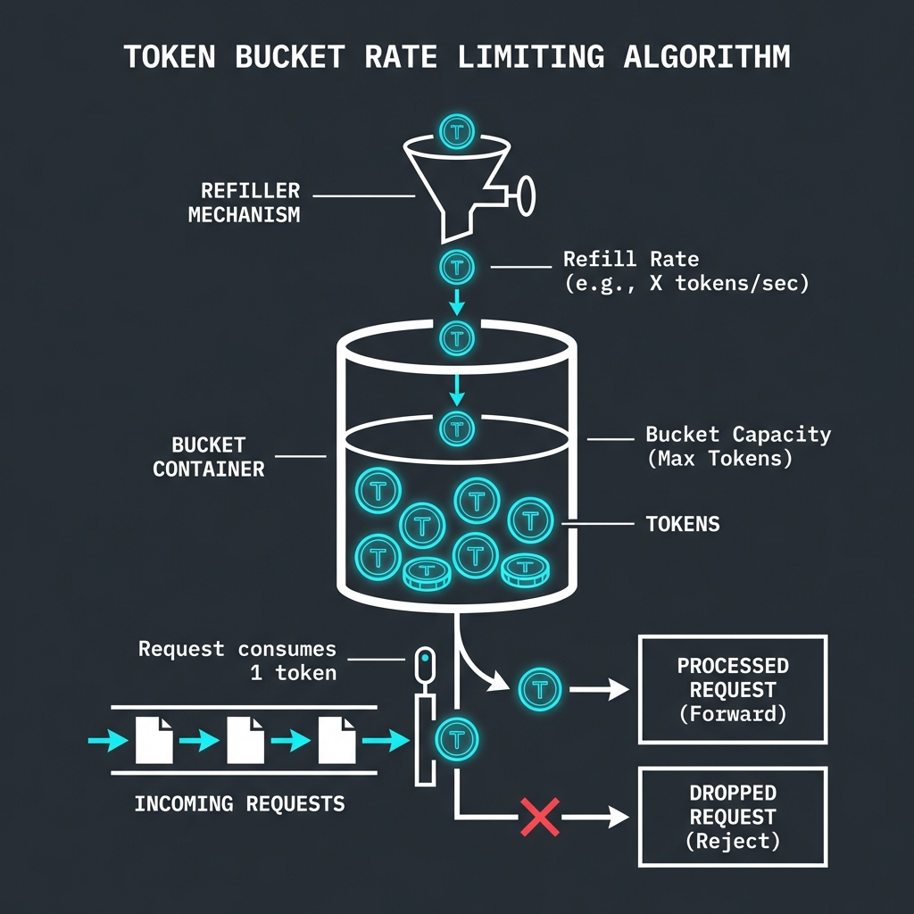

**How it works**:
*   A bucket holds **tokens** (permissions to make requests).
*   Tokens are **refilled** at a fixed rate (e.g., 10 tokens/second).
*   Each request **consumes 1 token**.
*   If no tokens available → Request is **rejected (429)**.

**Pros**:
*   ✅ Allows **burst traffic** (if bucket has accumulated tokens).
*   ✅ Simple to implement.

**Cons**:
*   ❌ Can be **memory-intensive** (need to track tokens per user).

**Use Case**: **API Rate Limiting** (e.g., "100 requests per minute per user").

---

### 3. 💧 Algorithm 2: Leaky Bucket
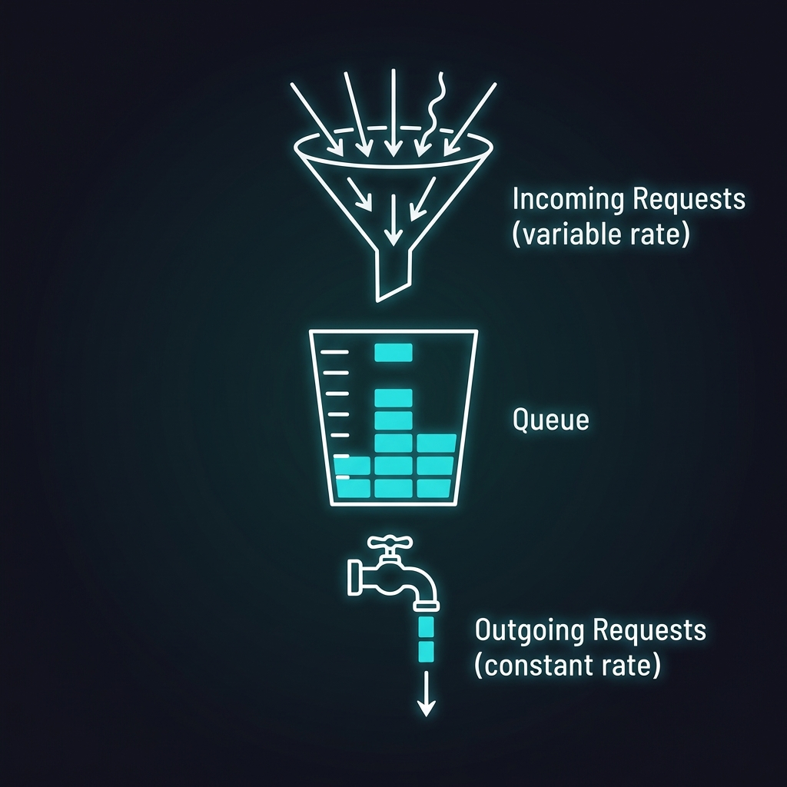

**How it works**:
*   Requests enter a **queue** (bucket).
*   Requests **leak out** (are processed) at a **constant rate** (e.g., 5 requests/second).
*   If queue is full → New requests are **dropped**.

**Pros**:
*   ✅ **Smooths traffic** (constant outgoing rate, no bursts).
*   ✅ Good for **network traffic shaping**.

**Cons**:
*   ❌ **No burst tolerance** (even if system is idle, rate stays constant).
*   ❌ Older requests might get **stale** in the queue.

**Use Case**: **Network Packet Scheduling** (ensuring steady bandwidth usage).

---

### 4. 🪟 Algorithm 3: Fixed Window Counter


**How it works**:
*   Divide time into **fixed windows** (e.g., 1-minute windows).
*   Count requests in each window.
*   Reset counter at the start of each new window.

**The Bug** (Burst at Boundaries):
*   **Window 1 (11:00:00 - 11:00:59)**: 100 requests at 11:00:58 ✅
*   **Window 2 (11:01:00 - 11:01:59)**: 100 requests at 11:01:01 ✅
*   **Problem**: 200 requests in **2 seconds** (11:00:58 to 11:01:01), but both windows say "OK".

**Pros**:
*   ✅ **Very simple** to implement.
*   ✅ Low memory usage.

**Cons**:
*   ❌ **Burst traffic** at window boundaries.

**Use Case**: **Basic rate limiting** where precision isn't critical.

---

### 5. 📜 Algorithm 4: Sliding Window Log
**How it works**:
*   Keep a **log** (timestamp) of every request.
*   When a new request arrives, **slide the window** (e.g., last 60 seconds).
*   Count requests in the sliding window.
*   **Delete old logs** outside the window.

**Pros**:
*   ✅ **Accurate** (no boundary burst issue).

**Cons**:
*   ❌ **Memory-intensive** (stores every request timestamp).

**Use Case**: **High-precision rate limiting** (e.g., financial APIs).

---

### 6. 🎯 Algorithm 5: Sliding Window Counter (Hybrid)
.png)

**How it works** (Best of Both Worlds):
*   Combines **Fixed Window** (low memory) + **Sliding Window** (accuracy).
*   Uses **weighted average** of previous and current window.

**Step-by-Step Example:**

Imagine it's **11:00:30** (you're 30 seconds = 50% into the current minute):
1. **Previous Window** (10:59:00 - 10:59:59): Had **150 requests**
2. **Current Window** (11:00:00 - 11:00:59): Has **40 requests** so far
3. **Your Position**: 50% into current window

**The Formula:**
```
Estimated Requests = (Previous_Window × Remaining%) + (Current_Window × Elapsed%)
                   = (150 × 50%) + (40 × 50%)
                   = 75 + 20
                   = 95 requests in the last 60 seconds
```

**Why the percentages?**
- If you're **10% into** current window → count **90% of previous** + **10% of current**
- If you're **80% into** current window → count **20% of previous** + **80% of current**
- This approximates a true "rolling window" without storing every timestamp!

**Pros**:
*   ✅ **Accurate** (solves boundary burst).
*   ✅ **Memory-efficient** (only stores 2 counters).

**Cons**:
*   ❌ Slightly more complex logic.

**Use Case**: **Production-grade rate limiting** (e.g., AWS API Gateway, Cloudflare).

---

### 7. 🏆 Which One to Use?
| Algorithm | Accuracy | Memory | Burst Support | Best For |
| :--- | :---: | :---: | :---: | :--- |
| **Token Bucket** | Medium | Medium | ✅ Yes | **API Rate Limiting** |
| **Leaky Bucket** | High | Medium | ❌ No | **Network Traffic Shaping** |
| **Fixed Window** | Low | Low | ❌ Boundary Bug | **Simple Counters** |
| **Sliding Log** | Very High | High | ✅ Yes | **Financial/Critical APIs** |
| **Sliding Counter** | High | Low | ✅ Yes | **🥇 Most Versatile (Recommended)** |

**Recommendation**: Use **Sliding Window Counter** for most production systems. It balances accuracy, memory, and burst tolerance.


---

## 2026-01-18 (Day 8)

**Focus**: Consistent Hashing.

### 1. 🔢 What is Hashing?
**Basic Concept**: A hash function takes input data and returns a fixed-size number (hash value).

**Simple Example**:
```python
def simple_hash(key):
    # Convert string to hash value
    return hash(key)

# Traditional approach (The Problem)
def get_server_index(key, num_servers):
    return simple_hash(key) % num_servers

# Example:
print(get_server_index("user123", 4))  # Output: 2 (server 2)
```

**The Rehashing Problem**:
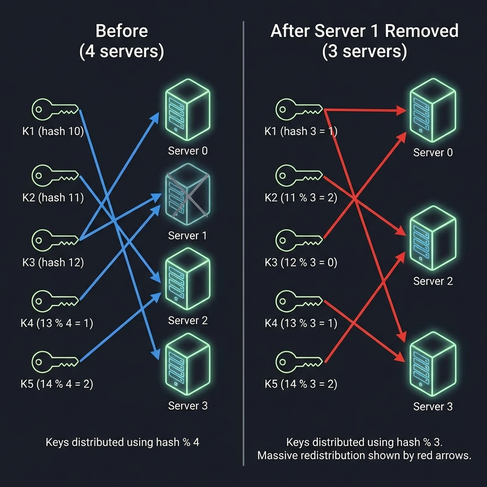

*   With **4 servers**: `hash("key0") % 4 = 1` → Server 1
*   **Server 1 goes offline** (now 3 servers): `hash("key0") % 3 = 0` → Server 0
*   **Problem**: Almost **ALL keys** get remapped to different servers → **Cache Miss Storm**

---

### 2. 🔄 Consistent Hashing: The Solution
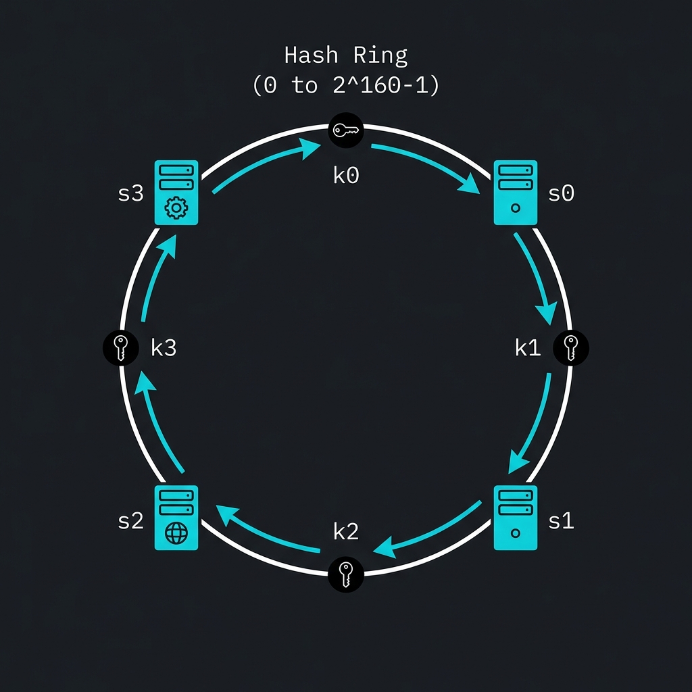

**Key Idea**: Instead of `hash % N`, we use a **Hash Ring** (0 to 2^160-1).

**How it works**:
1.  **Hash Ring**: Imagine a clock face (0 to 2^160-1), bent into a circle.
2.  **Place Servers**: Hash each server's IP/name onto the ring.
3.  **Place Keys**: Hash each key onto the ring.
4.  **Lookup Rule**: Go **clockwise** from the key until you find a server.

**Example**:
```
Ring positions (simplified 0-12):
- Server 0 at position 3
- Server 1 at position 7
- Server 2 at position 11

Key "user123" hashes to position 5
→ Go clockwise → First server found: Server 1 (at position 7)
→ Store "user123" on Server 1
```

**Benefit**: When Server 1 is removed, only keys **between Server 0 and Server 1** need to be moved to Server 2. Other keys stay put!

---

### 3. ⚠️ Problem 1: Uneven Distribution
**The Issue**: If servers are placed close together on the ring (e.g., Server 1 at position 10, Server 2 at position 11), Server 2 gets almost no keys.

**Example**:
```
Server 0 at position 3
Server 1 at position 10
Server 2 at position 11
→ Server 2's partition is tiny (11 to 3)
→ Server 0's partition is huge (3 to 10)
```

---

### 4. 🎯 Solution: Virtual Nodes
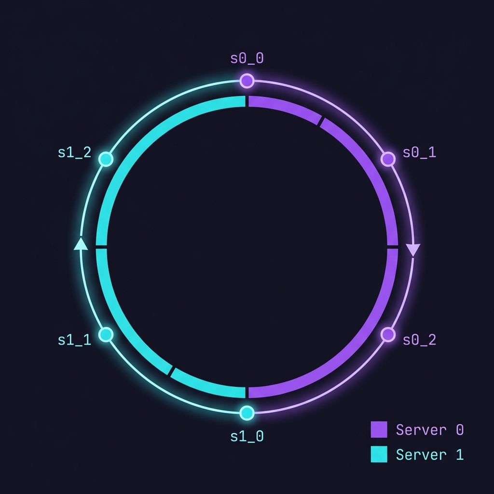

**Concept**: Instead of placing each server **once** on the ring, place it **multiple times** (e.g., 150 virtual nodes per server).

**How it works**:
```python
def get_virtual_node_positions(server_name, num_virtual_nodes=150):
    positions = []
    for i in range(num_virtual_nodes):
        virtual_name = f"{server_name}#{i}"
        positions.append(hash(virtual_name))
    return positions

# Example:
# Server 0 → s0#0, s0#1, s0#2, ..., s0#149 (150 positions on ring)
# Server 1 → s1#0, s1#1, s1#2, ..., s1#149 (150 positions on ring)
```

**Benefit**:
*   **Even Distribution**: With 150-200 virtual nodes, keys are distributed evenly (standard deviation < 10%).
*   **Smooth Scaling**: Adding/removing a server redistributes load across **all** remaining servers, not just neighbors.

---

### 5.  Problem 2: Celebrity Problem (Hotspot Keys)
**The Issue**: If all celebrity data (e.g., "Katy Perry", "Justin Bieber") hashes to the **same server**, that server gets overwhelmed.

**Partial Solution (Virtual Nodes)**:
*   Virtual nodes help **spread** the load, but if a **single key** (e.g., "Katy Perry's profile") is accessed 1 million times/sec, it still hits one server.

**Full Solution** (Beyond Consistent Hashing):
*   **Caching Layer** (Redis) in front of the database.
*   **Replication**: Store hot keys on multiple servers.
*   **Sharding by Access Pattern**: Use a different hash function for celebrity keys.

---

### 6.  Real-World Usage
Consistent Hashing is used in:
*   **Amazon DynamoDB** (data partitioning)
*   **Apache Cassandra** (cluster distribution)
*   **Discord** (chat sharding)
*   **Akamai CDN** (content routing)
*   **Google Maglev** (load balancing)

---

### 7. 📊 Summary Table
| Aspect | Traditional Hashing | Consistent Hashing |
| :--- | :--- | :--- |
| **Formula** | `hash(key) % N` | `hash(key)` on ring, go clockwise |
| **Keys Moved (Add Server)** | ~100% | ~1/N (minimal) |
| **Keys Moved (Remove Server)** | ~100% | ~1/N (minimal) |
| **Distribution** | Even (if N is fixed) | Uneven (without virtual nodes) |
| **Virtual Nodes** | N/A | Solves uneven distribution |
| **Use Case** | Static server pools | Dynamic scaling (cloud) |

**Key Takeaway**: Consistent Hashing minimizes data movement when servers are added/removed, making it ideal for distributed systems.


---

## 2026-01-21 (Day 9)

**Focus**: Video Streaming Engineering.

### 1. 📺 The Evolution of Streaming
**Old School: RTMP & RTSP**
*   **RTMP (Real-Time Messaging Protocol)**: By Adobe.
*   **RTSP (Real-Time Streaming Protocol)**: By RealNetworks.
*   **Pros**: Low latency (good for live chats).
*   **Cons**: Requires persistent connection (stateful), hard to scale, poor compatibility with modern browsers (Flash is dead).

**The Shift: Progressive Download / HTTP**
*   Download the full video file (`.mp4`) via HTTP.
*   **Problem**: Wastes bandwidth if user stops watching; no quality switching.

---

### 2. 🌊 Adaptive Bitrate Streaming (ABR)
**The Modern Solution**: Adjust video quality **dynamically** based on user's internet speed and device.

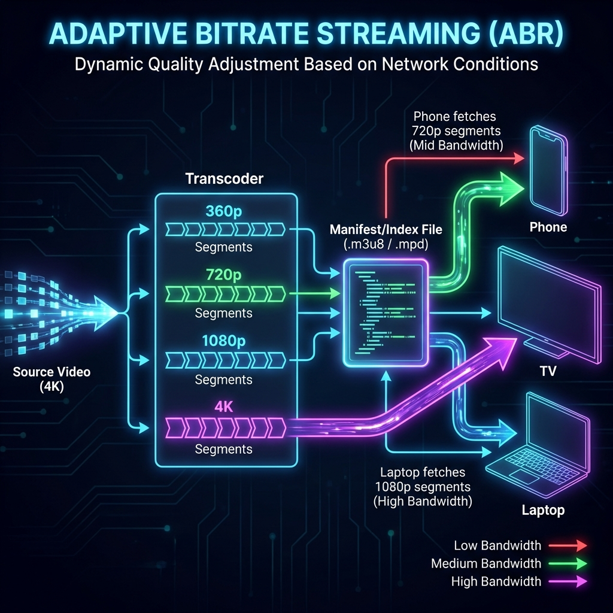

**How it Works (The Pipeline)**:
1.  **Source Video**: 4K raw file uploaded to server.
2.  **Transcoding**: Server breaks video into small **Segments** (chunks of 2-10 seconds) at multiple qualities (360p, 720p, 1080p).
3.  **Manifest File**: An "index" file (`.m3u8` or `.mpd`) lists all available segments and bitrates.
4.  **Client (Player)**:
    *   Downloads Manifest.
    *   Checks network speed.
    *   Fetches the *best possible segment* for that moment.
    *   **Result**: Smooth playback (starts at 360p, jumps to 1080p when buffer is safe).

---

### 3. 📜 Protocols: HLS vs DASH
| Feature | **HLS (HTTP Live Streaming)** | **MPEG-DASH (Dynamic Adaptive Streaming over HTTP)** |
| :--- | :--- | :--- |
| **Creator** | Apple | International Standard (MPEG) |
| **Manifest File** | `.m3u8` | `.mpd` (Media Presentation Description) |
| **Codec** | H.264, H.265 | Codec Agnostic (H.264, VP9, AV1) |
| **Compatibility** | Native on iOS/Mac, widely supported | Native on Android/Windows, widely supported |
| **Usage** | Dominant standard today | Widely used open alternative |

---

### 4. 🛠️ Practical Implementation (ImageKit Example)
Instead of building a transcoder from scratch (using FFmpeg), we can use a service like **ImageKit**.

**The Process**:
1.  Upload Master Video (`source.mp4`).
2.  Request the **Manifest URL** with transformation parameters.

**HLS Example (`.m3u8`)**:
```
https://ik.imagekit.io/demo/sample-video.mp4/ik-master.m3u8?tr=sr-240_360_480_720_1080
```
*   `tr=sr-...`: Tells ImageKit to generate segments for 240p, 360p, 480p, 720p, and 1080p.

**MPEG-DASH Example (`.mpd`)**:
```
https://ik.imagekit.io/demo/sample-video.mp4/ik-master.mpd?tr=sr-240_360_480_720_1080
```

**Key Note**:
*   The first request might return `202 Processing` while it generates segments in the background.
*   Once done, it returns `200 OK` with the streaming manifest.


