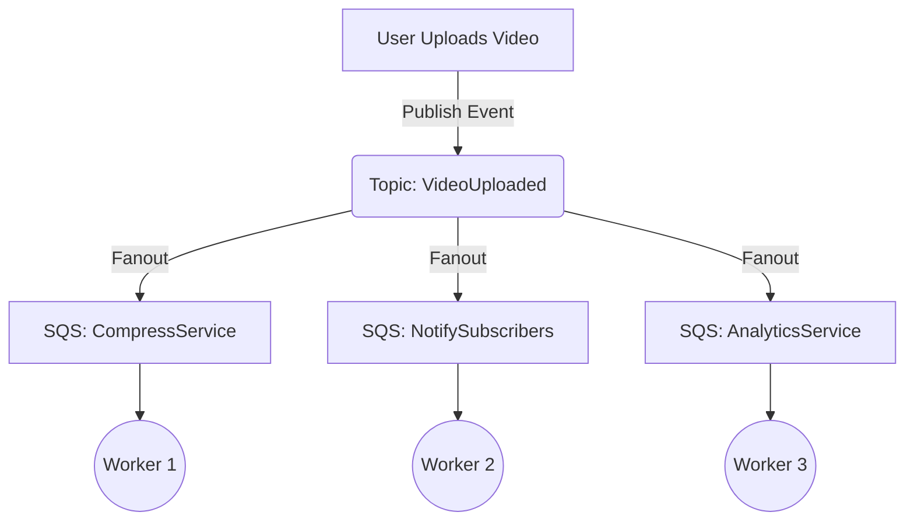
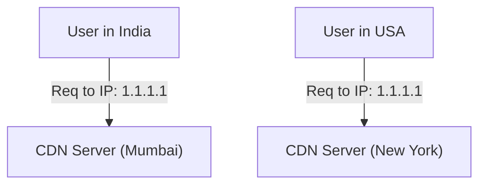
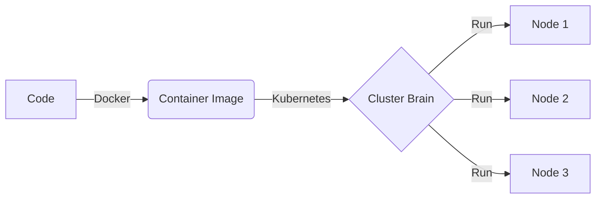

# System Design Learning Log

Documenting my journey learning Distributed Systems and High-Level Architecture.

## 2026-01-08 (Day 1)
**Playlist**: [System Design Series](https://www.youtube.com/playlist?list=PLinedj3B30sBlBWRox2V2tg9QJ2zr4M3o)

**Topics Covered**:
- **Scaling**: Learned the difference between Vertical (bigger hardware) and Horizontal (more machines) scaling. Horizontal is preferred for infinite scale.
- **Load Balancing**: Understood "Round Robin" algorithm to distribute traffic broadly.
- **API Gateway**: The "Front Door" pattern that routes requests to microservices.
- **Fan-out Architecture**: Using a pattern where one message is pushed to multiple queues for parallel processing.
- **Queues (SQS)**: Decoupling services so the sender doesn't wait for the receiver (Asynchronous processing).

---

## 2026-01-09 (Day 2)

**Focus**: Microservices Communication, Database Scaling, & Cloud Evolution.

### 1. 📨 Async Communication & Queues
**Problem**: How do Microservice A and Microservice B talk without crashing each other?
**Solution**: **Queues** (Decoupling).

**Push vs Poll**:
*   **Poll (Pull)**: "Are we there yet?" (Service B constantly asks Queue).
*   **Push (Webhook)**: "Ding Dong!" (Queue notifies Service B, like a doorbell ringing).


### 2. 📢 Pub/Sub & Fanout Pattern
**Concept**: One event happens (User Uploads Video), but arguably *many* things need to happen (Compress, Notify Friends, Analytics).
**Tool**: Combining **Pub/Sub** (AWS SNS) with **Queues** (AWS SQS).



### 3. 💾 Database Scaling: Master-Slave
**Rule**: Separation of Duties.
*   **Primary DB (Master)**: Handles **Writes** (INSERT, UPDATE). Source of Truth.
*   **Secondary DB (Read Replica)**: Handles **Reads** (SELECT). Used for analytical queries/reporting.

```mermaid
graph LR
    User -->|Write (Insert)| Master[("Primary DB")]
    User -->|Read (Select)| Slave1[("Read Replica 1")]
    User -->|Read (Select)| Slave2[("Read Replica 2")]
    
    Master -.->|Async Replication| Slave1
    Master -.->|Async Replication| Slave2
```

### 4. 🌍 Content Delivery Network (CDN) & Anycast
**Anycast**: Magic routing where multiple servers around the world share the **same IP address**. The user is routed to the *physically closest* one.



### 5. ⚡ Serverless (AWS Lambda)
**Concept**: "I just want to run this function. I don't want to manage a server."

*   **Pros**:
    *   💸 Pay per millisecond (Cheap for sporadic traffic).
    *   🚀 No Server Management.
*   **Cons**:
    *   🥶 **Cold Start**: First request takes time (spinning up the container).
    *   🔒 **Vendor Lock-in**: Hard to move code from AWS to Google later.

### 6. 🐳 Evolution of Compute
From "Works on my Machine" to "Works Everywhere".

**Timeline**:
1.  **Physical Servers**: Hard to maintain, waste of space.
2.  **Virtual Machines (VMs)**: Better, but OS overhead is heavy.
3.  **Containers (Docker)**: Lightweight, isolates just the app.
4.  **Container Orchestration (Kubernetes/K8s)**:
    *   *History*: Google had a secret system called **Borg** to manage billions of containers.
    *   *Release*: They open-sourced a version of it as **Kubernetes**.
    *   *Role*: It is the "Brain" that decides where containers run, restarts them if they crash, and scales them.


