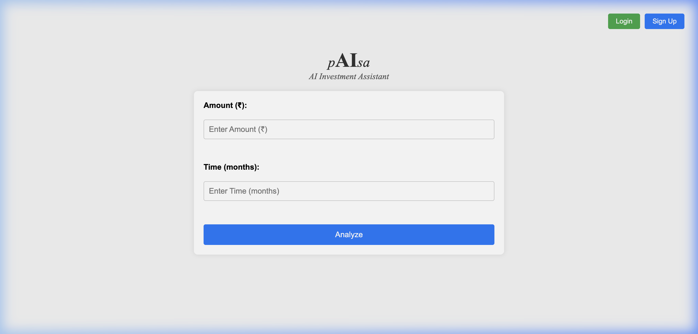
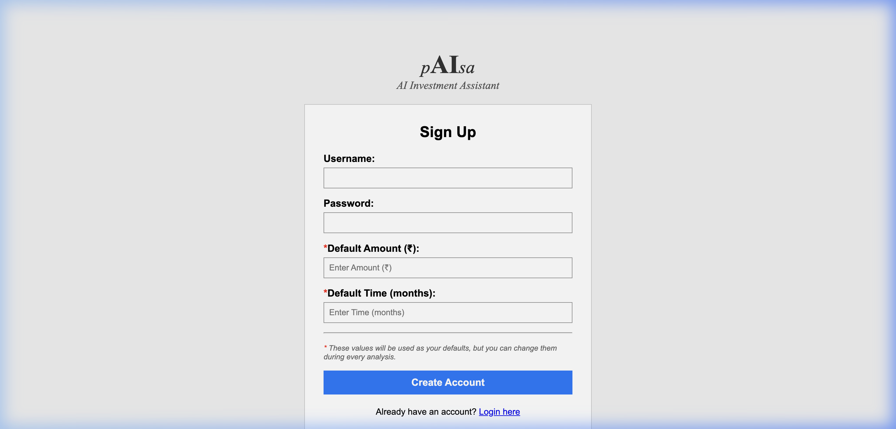
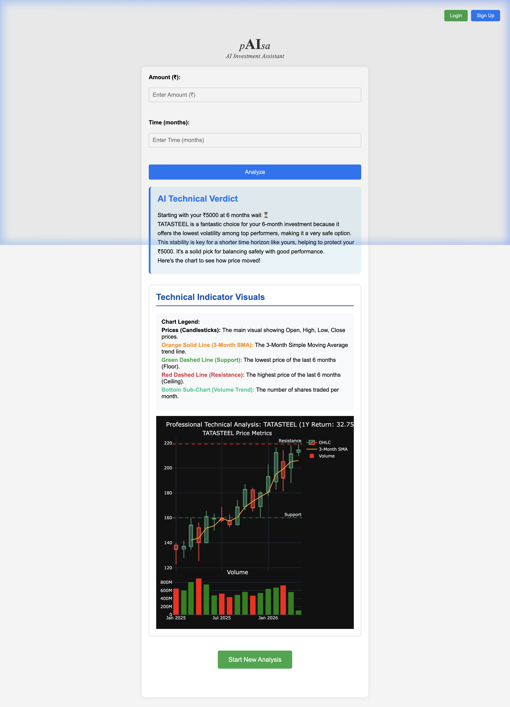

<p align="center">
  
</p>

<p align="center">
  <i>A simple, intelligent, and personalized stock analysis dashboard for the Indian Market.</i>
</p>

---

## 🎬 See It In Action


---

## 🚀 Overview

**pAIsa** (p + AI + sa) is a web-based investment assistant that helps you make sense of the stock market. Unlike complex trading terminals, **pAIsa** focuses on simplicity and clear AI-driven insights tailored to your specific budget and time horizon.

### Key Features

- **User Registration**: Create a personalized account to save your investment preferences.
- **Smart Defaults**: Save your typical investment amount and time horizon to speed up your daily analysis.
- **AI-Powered Verdicts**: Uses Google Gemini 2.5 Flash to analyze Nifty 50 stocks and provide simple, friendly "Buy/Hold/Avoid" advice.
- **Professional Charts**: Interactive candlestick charts with support/resistance levels and volume trends.
- **Clean "Basic" Design**: A distraction-free interface built with basic HTML/CSS/JS for maximum speed and clarity.

---

## 📸 Screenshots

### 1. The Dashboard (Home)

The simple entry point for your analysis. Enter your budget and how long you want to wait.


### 3. Personalized Signup

Create an account to store your default preferences.


### 4. AI Analysis & Professional Charts

Get a clear verdict from the AI along with technical indicators and professional-grade charts.


---

## 🛠️ Technical Stack

- **Backend**: FastAPI (Python)
- **Database**: SQLite (Local, high-performance storage)
- **AI**: Google Gemini 2.5 Flash (Generative AI)
- **Market Data**: Upstox API V3
- **Frontend**: Basic HTML5, Vanilla CSS3, and Embedded JavaScript
- **Charts**: Plotly.js (Professional Technical Analysis charts)

---

## 🚦 Getting Started

1. **Install Dependencies**:

   ```bash
   uv sync
   ```
2. **Configure Environment**:
   Ensure your `.env` file has your `UPSTOX_ACCESS_TOKEN` and `GOOGLE_API_KEY`.
3. **Run the Dashboard**:

   ```bash
   uv run uvicorn trading_pAIsa.main:app --host 0.0.0.0 --port 8000
   ```
4. **Access**:
   Open `http://localhost:8000` in your browser.
